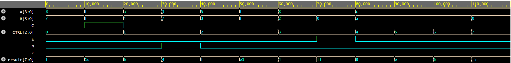

# 4-Bit ALU in Verilog

## Overview

This project implements a simple 4-bit Arithmetic Logic Unit (ALU) using Verilog HDL.

The ALU supports arithmetic and logical operations controlled by a 3-bit control signal.

## Features

### Arithmetic Operations

* Addition
* Subtraction
* Multiplication
* Division

### Logical Operations

* AND
* OR
* XOR
* NOT

### Status Flags

* Zero Flag (Z)
* Carry Flag (C)
* Negative Flag (N)
* Error Flag (E)

## Control Signals

| CTRL | Operation      |
| ---- | -------------- |
| 000  | Addition       |
| 001  | Subtraction    |
| 010  | Multiplication |
| 011  | Division       |
| 100  | AND            |
| 101  | OR             |
| 110  | XOR            |
| 111  | NOT            |

## Simulation

The design was simulated using EDA Playground with the Icarus Verilog simulator.

## Sample Output

```text
CTRL A B RESULT Z C N E
000  8 7 15 0 0 0 0
000 15 15 30 0 1 0 0
001 10 4 6 0 0 0 0
001 3 7 4 0 0 1 0
010 15 15 225 0 0 0 0
011 8 0 255 0 0 0 1
```

## Waveform



## Future Improvements

* Overflow flag implementation
* Gate-level ALU implementation
* Accumulator-based architecture
* Clocked sequential ALU
