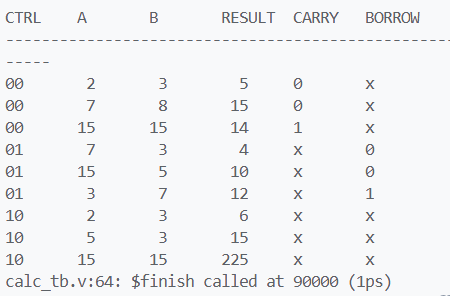
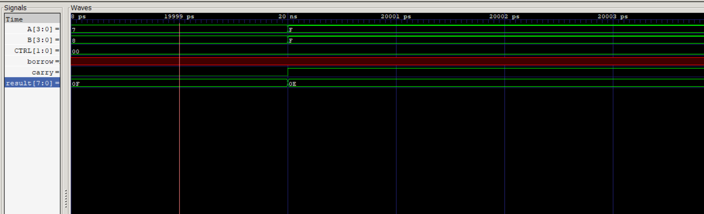
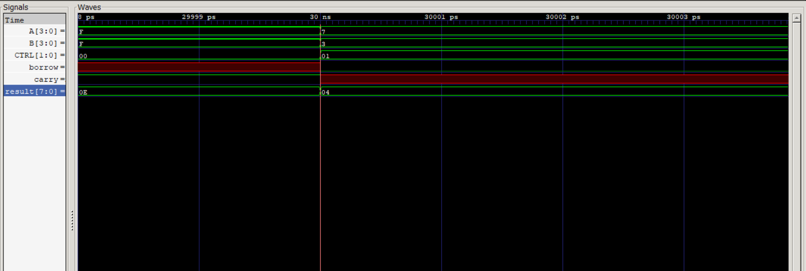
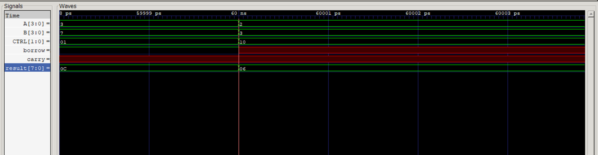

# Gate-Level Calculator in Verilog

## Overview

This project implements a 4-bit gate-level calculator in Verilog HDL. The calculator supports arithmetic operations including addition, subtraction, and multiplication using a modular structural design approach.

The design was developed and verified using Icarus Verilog and GTKWave.

## Features

* 4-bit Addition
* 4-bit Subtraction
* 4-bit Multiplication
* Carry flag for addition
* Borrow flag for subtraction
* Structural (gate-level) implementation
* Modular design using reusable building blocks

## Project Structure

```text
.
├── half_adder.v
├── full_adder.v
├── adder4.v
├── subtractor4.v
├── multiplier4.v
├── calc.v
├── calc_tb.v
├── README.md
└── images/
```

## Design Hierarchy

```text
Calculator
│
├── Adder4
│   ├── Half Adder
│   └── Full Adders
│
├── Subtractor4
│   ├── NOT Gates
│   └── Full Adders
│
└── Multiplier4
    ├── Partial Product Generation
    ├── Half Adders
    └── Full Adders
```

## Control Signals

| CTRL | Operation      |
| ---- | -------------- |
| 00   | Addition       |
| 01   | Subtraction    |
| 10   | Multiplication |

## Simulation Results

Example simulation output:

```text
CTRL    A    B    RESULT    CARRY    BORROW

00      2    3      5         0         X
00      7    8     15         0         X
00     15   15     14         1         X

01      7    3      4         X         0
01     15    5     10         X         0
01      3    7     12         X         1

10      2    3      6         X         X
10      5    3     15         X         X
10     15   15    225         X         X
```

## Result Screenshot

*Insert simulation result screenshot here.*





## Addition Waveform

*Insert addition waveform screenshot here.*





## Subtraction Waveform

*Insert subtraction waveform screenshot here.*




## Multiplication Waveform

*Insert multiplication waveform screenshot here.*





## Tools Used

* Verilog HDL
* Icarus Verilog
* GTKWave
* Visual Studio Code
* Git & GitHub

## Future Improvements

* Division Module
* Zero Flag
* Negative Flag
* Overflow Detection
* Fully Structural Multiplexer-Based Control Logic
* FPGA Implementation and Hardware Validation

## Author

Aadrish Guha Majumdar

BITS Pilani, K. K. Birla Goa Campus
